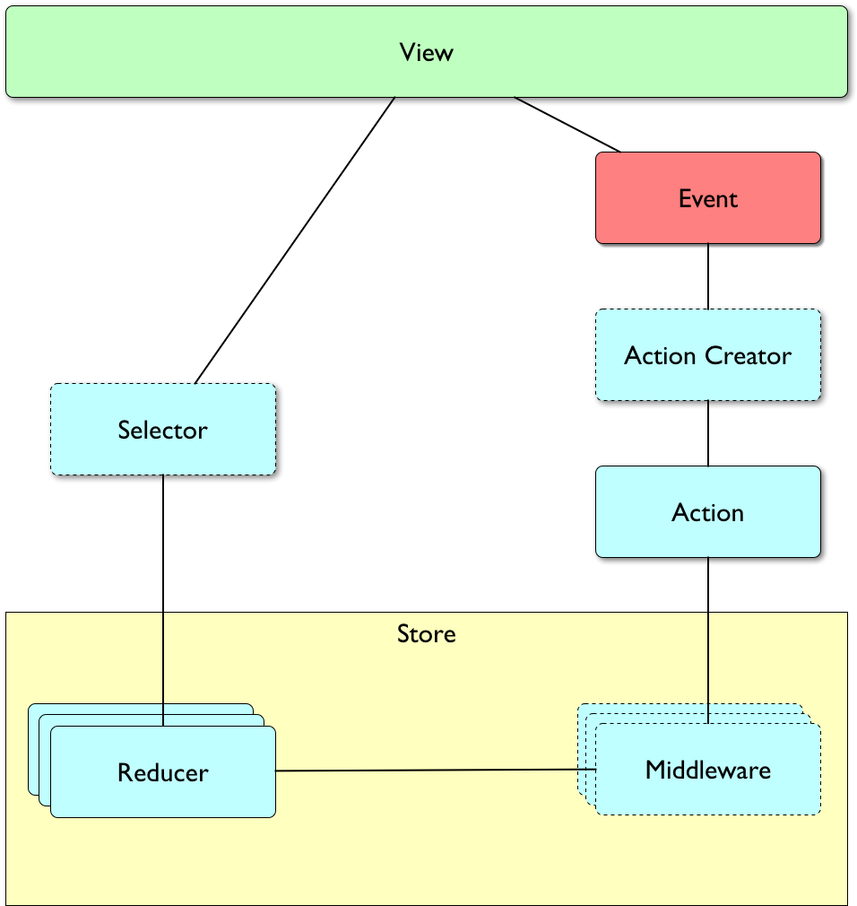

# Redux

## The Flux Architecture

**Flux** is a generic architecture or pattern, rather than a specific implementation. Its ideas were first introduced publicly by Bill Fisher and Jing Chen at the Facebook F8 conference in April 2014. Flux was touted as redefining the previous ideas of MVC (Model–View–Controller) and MVVM (Model–View–ViewModel) patterns and two-way data binding introduced by other frameworks by suggesting a new flow of events on the frontend, called the unidirectional data flow.

In Flux events are managed one at a time in a circular flow with a number of actors: **dispatcher**, **stores**, and **actions**. An **action** is a structure describing any change in the system: mouse clicks, timeout events, Ajax requests, and so on. Actions are sent to a **dispatcher**, a single point in the system where anyone can submit an action for handling. The application state is then maintained in **stores** that hold parts of the application state and react to commands from the dispatcher.

A simple Flux flow:

1. Stores subscribe to a subset of actions.
2. An action is sent to the dispatcher.
3. The dispatcher notifies subscribed stores of the action.
4. Stores update their state based on the action.
5. The view updates according to the new state in the stores. 
6. The next action can then be processed.

This flow ensures that it’s easy to reason about how actions flow in the system, what will cause the state to change, and how it will change. In Flux, the click event will generate a single action that will mutate the store and then the view. Any actions created by the store or other components during this process will be queued and executed only after the first action is done and the view is updated. 

## An Introduction to Redux

Redux is about functional programming and pure functions. Understanding these concepts is crucial to understanding the underlying principles of Redux. Redux can be described in *three fundamental principles*:

1. **Single source of truth.** The *state* of your whole application is stored in an object tree within a single *store*. This makes it easy to create universal apps, as the state from your server can be serialized and hydrated into the client with no extra coding effort. A single state tree also makes it easier to debug or introspect an application; it also enables you to persist your app's state in development, for a faster development cycle. Some functionality which has been traditionally difficult to implement - Undo/Redo, for example - can suddenly become trivial to implement, if all of your state is stored in a single tree.
2. **State is read-only.** The only way to change the state is to emit an *action*, an object describing what happened. This ensures that neither the views nor the network callbacks will ever write directly to the state. Instead, they express an intent to transform the state. Because all changes are centralized and happen one by one in a strict order, there are no subtle race conditions to watch out for. As actions are just plain objects, they can be logged, serialized, stored, and later replayed for debugging or testing purposes.
3. **Changes are made with pure functions.** To specify how the state tree is transformed by actions, you write *pure reducers*. Reducers are just pure functions that take the previous state and an action, and return the next state. Remember to return new state objects, instead of mutating the previous state. You can start with a single reducer, and as your app grows, split it off into smaller reducers that manage specific parts of the state tree. Because reducers are just functions, you can control the order in which they are called, pass additional data, or even make reusable reducers for common tasks such as pagination.

### The Redux Architecture



### Pure and impure functions
- A **pure function** returns values by using only its arguments: it uses no additional data and changes no data structures, touches no storage, and emits no external events (like network calls). This means that you can be completely sure that every time you call the function with the same arguments, you will always get the same result. 
- An **impure function** uses any variables not passed in as arguments or creates *side effects*. When a function depends on variables or functions outside of its lexical scope, you can never be sure that the function will behave the same every time it’s called.

### Immutability
- **Immutability** means that something can’t be changed, guaranteeing developers that if you create an object, it will have the same properties and values forever. To make a JavaScript object appear immutable, we can use the `Object.freeze()` method.
- JavaScript does not provide good native ways to make data structures fully immutable. `Object.freeze()` won’t freeze nested objects. 
- To work around this, use third-party libraries like [deep-freeze](https://github.com/substack/deep-freeze) or [ImmutableJS](https://facebook.github.io/immutable-js/).


## Actions

- Actions are payloads of information that send data from your application to your store. 
- They are the only source of information for the store. 
- You send them to the store using `store.dispatch()`.
- Actions are plain JavaScript objects. 
- Actions must have a `type` property that indicates the *type of action being performed*. 
- Types should typically be defined as *string constants*. 
- Once your app is large enough, you may want to move them into a separate module.
- In Redux, it’s common to put actions in the `actions` directory

```javascript
const ADD_TODO = 'ADD_TODO';
```

## Action creators

- Action creators are exactly that—*functions that create actions*. 
- One problem you might encounter while dispatching actions from the console to test the store is that it’s hard to remember the properties that need to be passed in the action object. This, among other reasons, is why in Redux we use the concept of action creators: functions that create the action object for us. This function both hides the structure of the action from the user and allows us to modify the action, setting default values for properties, performing cleanup, trimming names, and so on.

```javascript
import { ADD_TODO } from './actionTypes';

function addTodo(text) {
  return {
    type: ADD_TODO,
    text
  }
}
```
- In Redux, action creators simply return an action. In traditional Flux, action creators often trigger a dispatch when invoked. In Redux this is *not* the case. Instead, to actually initiate a dispatch, pass the result to the `dispatch()` function:

```javascript
dispatch(addTodo(text));
```


## Reducers
- A *reducer* is a pure function that takes the previous state and an action, and returns the next state.
- Things you should never do inside a reducer:
	- Mutate its arguments;
	- Perform side effects like API calls and routing transitions;
	- Call non-pure functions, e.g. `Date.now()` or `Math.random()`.
- Given the same arguments, it should calculate the next state and return it. No surprises. No side effects. No API calls. No mutations. Just a calculation.
- We return the previous state in the default case. It's important to return the previous state for any unknown action.

```javascript
const reducer = (state = '', action) => {
	nextState = undefined;
	switch(action.type) {
		case 'SOME_ACTION_TYPE': 
			nextState = 'Success!';
		...
	}
	// Incoming state is immutable, create new state based on action.
	return nextState;
}
```

- Our reducers *must never change the state*, but only create a new copy of it, with any modifications needed. Thus you will need to clone state frequently in your reducers:

```javascript
const reducer = (state, action) => { 
    switch (action.type) {
        case 'ADD_RECIPE':
            return Object.assign({}, state, {
                recipes: state.recipes.concat({ name: action.name })
            });
    }
    return state; 
};
```

- In Redux, it’s common for the directory structure to follow the names of the Redux “actors.” Reducers are placed in the `reducers` directory


## Middleware

- Middleware is a more advanced feature of Redux. 
- The middleware act like interceptors for actions before they reach the store: they can modify the actions, create more actions, suppress actions, and much more. 
- Since the middleware have access to the actions, the `dispatch()` function, and the store, they are the most versatile and powerful entities in Redux.
- Every action will be first passed through a list of middleware.
- Unlike reducers, middleware can modify, stop, or add more actions. 
- Examples might include: a logging middleware, an authorization middleware that checks if the user has permissions to run the action, or an API middleware that sends something to the server.

```javascript
const middleware = ({dispatch, getState}) => 
	(next) => (action) => {
		console.log(action);
		return next(action);
	}	

```

## Store

- Unlike many other Flux implementations, Redux has a *single store* that holds the application information but no user logic. 
- The role of the store is to receive *actions*, pass them through all the registered *middleware*, and then use *reducers* to calculate a new state and save it.
- When it receives an action that causes a change to the state, the store will notify all the registered listeners that a change to the state has been made. This will allow various parts of the system, like the UI, to update themselves according to the new state.

## `Provider` component

- A React component that you’ll render at the top of the React app. 
- Any components rendered as children of `<Provider>` can be granted access to the Redux store via `connect()` function.
- Normally, you can’t use connect() without wrapping a parent or ancestor component in `<Provider>`. If you really need to, you can manually pass store as a prop to every `connect()`ed component, but we only recommend to do this for stubbing store in unit tests, or in non-fully-React codebases. Normally, you should just use `<Provider>`.

```javascript
ReactDOM.render(
  (<Provider store={store}>
    <MyRootComponent />
  </Provider>), rootEl);
```

With React-Router:

```javascript
ReactDOM.render(
  (<Provider store={store}>
    <Router history={history}>
      <Route path="/" component={App}>
        <Route path="foo" component={Foo}/>
        <Route path="bar" component={Bar}/>
      </Route>
    </Router>
  </Provider>),  document.getElementById('root'));
```

## `connect` function

- Connects a React component to a Redux store. The `connect` function is a facade around `connectAdvanced`, providing a convenient API for the most common use cases.
- It does not modify the component class passed to it; instead, it returns a new, connected component class for you to use.
- See [here](https://github.com/reactjs/react-redux/blob/master/docs/api.md#connectmapstatetoprops-mapdispatchtoprops-mergeprops-options) for more details.

## `mapStateToProps` function

- Pass only relevant data to the component being connected. 
- We write this function to specify exactly which slice of the store's state we want to provide to our component.
- We write this function ourselves and use it in the `connect()` call.


## `mapDispatchToProps` function

- Allows removing references to Redux inside our components by passing the dispatching actions as props to the component, alleviating the need to call `store.dispatch()` from our component. 
- We write this function ourselves and use it in the `connect()` call.


## Presentational vs. container components

Separating things into container and presentational components is a convention, not a hard and fast rule that React or Redux enforces. But, it’s one of the most popular and pervasive patterns for a reason. It allows us to decouple how our app looks from what it does. Defining our UI as presentational components means we have simple, flexible building blocks that are easy to reconfigure and reuse. When we’re working with data from Redux, we can deal with container components without having to worry about markup. The inverse applies for when we are working with UI.

### Presentational components

- Don’t have dependencies on Redux. They don’t know or care that we’re using Redux to manage our application state. By using presentational components, we’ve introduced determinism into our view renders. In other words, given the same data, we’ll always have the same rendered output. 
- Presentational components then, are easily tested and provide our application with sweet, sweet predictability.

### Container components

- Have dependencies on Redux.
- Get data from the Redux store via `connect` function.
- Use `mapStateToProps` function to pass only relevant data to the component being connected.
- Render presentational components.

## Handling side-effects

### redux-saga

[redux-saga](https://github.com/redux-saga/redux-saga) is a library that aims to make *application side effects* (i.e. asynchronous things like data fetching and impure things like accessing the browser cache) easier to manage, more efficient to execute, simple to test, and better at handling failures.

The mental model is that a saga is like a separate thread in your application that's solely responsible for side effects. `redux-saga` is a redux middleware, which means this thread can be started, paused and cancelled from the main application with normal redux actions, it has access to the full redux application state and it can dispatch redux actions as well.

It uses an ES6 feature called Generators to make those asynchronous flows easy to read, write and test. (if you're not familiar with them [here are some introductory links](https://redux-saga.js.org/docs/ExternalResources.html)) By doing so, these asynchronous flows look like your standard synchronous JavaScript code. (kind of like `async`/`await`, but generators have a few more awesome features we need).

`redux-saga` reifies side effects into artifacts called *Effects*. The Effects can be generated by another artifact called *Sagas*. Think of saga as long-live processes that interacts with the system by:

- Reacting to actions dispatched in the system.
- Dispatches new actions into the system.
- Can “wake itself” using internal mechanisms without actions being dispatched. e.g. waking up on interval

In redux-saga, a saga is a *generator* function that can run indefinitely inside the system. It can be woken up when a specific action is dispatched. It can dispatch additional actions, and has access to the application state atom.


### redux-thunk

Redux Thunk middleware allows you to write action creators that return a function instead of an action. The thunk can be used to delay the dispatch of an action, or to dispatch only if a certain condition is met. The inner function receives the store methods dispatch and getState as parameters.

An action creator that returns a function to perform asynchronous dispatch:

```javascript
const INCREMENT_COUNTER = 'INCREMENT_COUNTER';

function increment() {
  return {
    type: INCREMENT_COUNTER
  };
}

function incrementAsync() {
  return dispatch => {
    setTimeout(() => {
      // Yay! Can invoke sync or async actions with `dispatch`
      dispatch(increment());
    }, 1000);
  };
}
```

An action creator that returns a function to perform conditional dispatch:

```javascript
function incrementIfOdd() {
  return (dispatch, getState) => {
    const { counter } = getState();

    if (counter % 2 === 0) {
      return;
    }

    dispatch(increment());
  };
}
```

What’s a thunk? A thunk is a function that wraps an expression to delay its evaluation.

```javascript
// calculation of 1 + 2 is immediate
// x === 3
let x = 1 + 2;

// calculation of 1 + 2 is delayed
// foo can be called later to perform the calculation
// foo is a thunk!
let foo = () => 1 + 2;
```


### redux-observable
[redux-observable](https://redux-observable.js.org) is a RxJS 5-based middleware for Redux. Compose and cancel async actions to create side effects and more. `redux-observable` requires an understanding of Observables with RxJS v5. If you're new to Reactive Programming with RxJS v5, head over to [http://reactivex.io/rxjs/](http://reactivex.io/rxjs/) to familiarize yourself first.

`redux-observable` (because of RxJS) truly shines the most for complex async/side effects. If you're not already comfortable with RxJS you might consider using `redux-thunk` for simple side effects and then use `redux-observable` for the complex stuff. That way you can remain productive and learn RxJS as you go. `redux-thunk` is much simpler to learn and use, but that also means it's far less powerful. Of course, if you already love Rx like we do, you will probably use it for everything!


